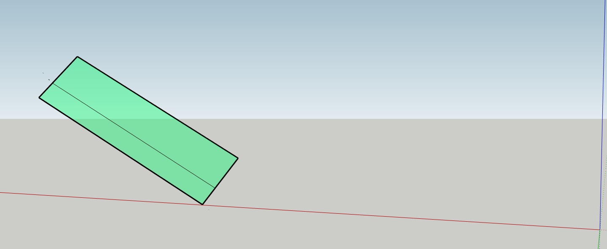
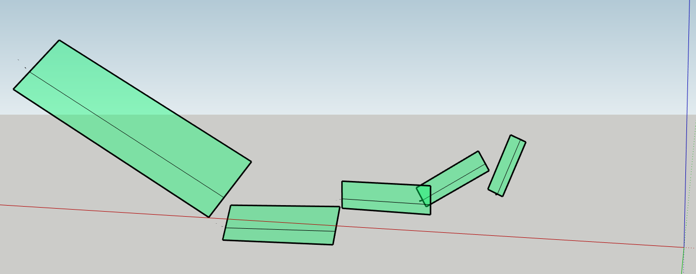
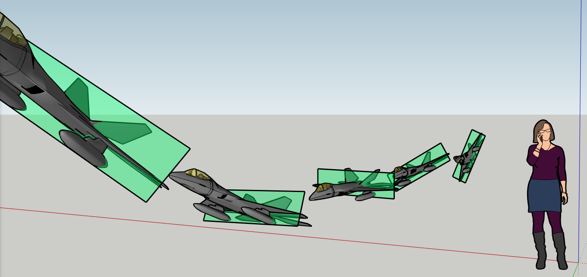

[](https://discord.gg/6zMa4Tp)
[](https://ci.appveyor.com/project/DavidMcCabe/simpleflightpathsimulator)


### An Off-site Coronavirus Programme

- **[Team Objectives](./docs/programme_goals.md)...**
- **[Programme Structure](./docs/programme_structure.md)...**
# Simple Flightpath Simulator

A desktop application for scripting aircraft motion in three dimensions.

## The Waypoint


A **Waypoint** has;
- a **Fly-through Time** (time at which the aircraft flies through the waypoint)
- a **3D Position**
  - x, North (Relative)
  - y, East (Relative)
  - z, Altitude (Relative)

- a **3D Orientation**
  - Roll - Rotation about x [-180,180)
  - Pitch - Rotation about y [-90,90)
  - Yaw - Rotation about z [-180,180)

## Waypoint Queue

The course of the aircraft is defined by a sequence of waypoints.  These are read in using .xml
```xml
<WaypointQueue>
  <Waypoint time="0.0">
    <Position x="0.5" y="1.5" z="0.0"/>
    <Orientation pitch="0.0" roll="0.1" yaw="0.0"/>
  </Waypoint>
  <Waypoint time="1.0">
    <Position x="1.5" y="1.5" z="0.0"/>
    <Orientation pitch="0.0" roll="0.2" yaw="0.0"/>
  </Waypoint>
  <Waypoint time="2.0">
    <Position x="2.5" y="1.5" z="0.0"/>
    <Orientation pitch="0.0" roll="0.3" yaw="0.0"/>
  </Waypoint>
</WaypointQueue>
```

## Flightpath Calculation

This tool simply interpolates between waypoints so values for Position, Orientation, Velocity and Rotation are known at any instant of time. 
